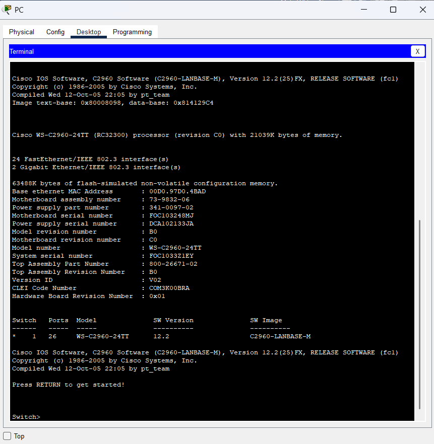
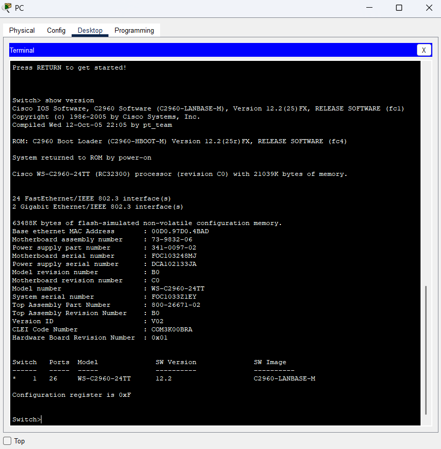
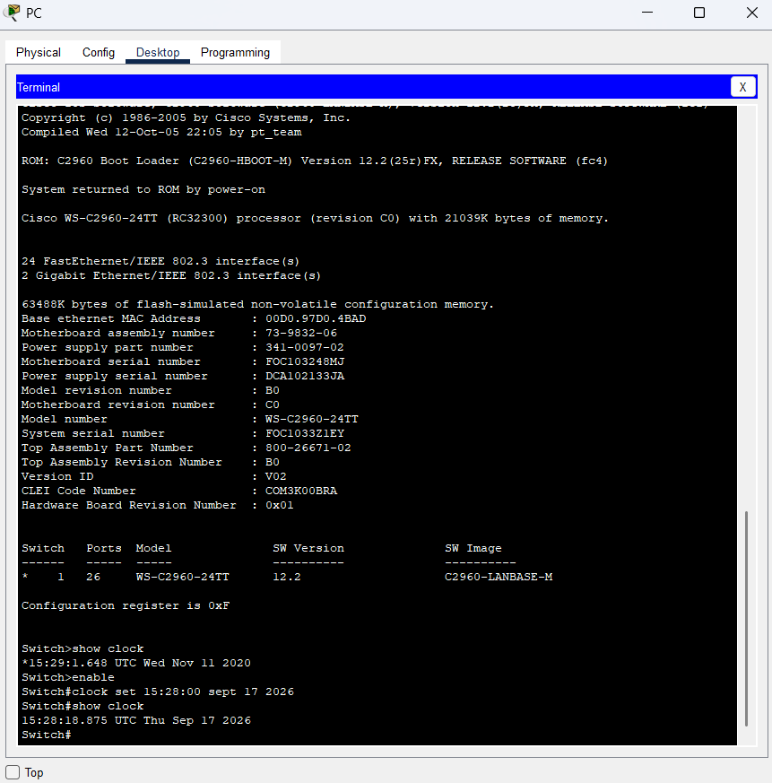
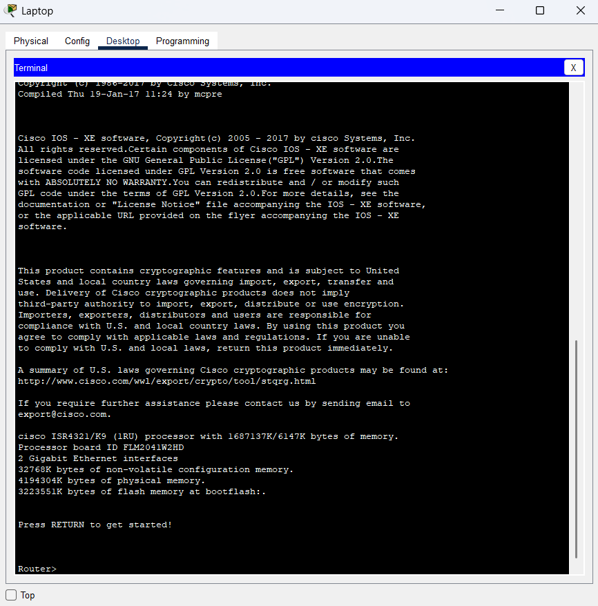

# Lab 01 – Cisco Device Console Access & Basic Device Settings

## Objective

The objectives of this lab were:

- Access a Cisco switch through the serial console port.
- Display and configure basic device settings.
- Access a Cisco router using a Mini-USB console cable.

## Lab Environment

- Cisco Packet Tracer
- Cisco Catalyst 2960 Switch
- Cisco ISR 4321 Router
- PC
- Console connection
- Terminal

## Part 1 – Access Cisco Switch Through Serial Console

I connected a PC to a Cisco Catalyst 2960 switch using a rollover console cable and established a console session through the Packet Tracer Terminal.

### Result

Successfully accessed the Cisco IOS Command-Line Interface (CLI) and reached User EXEC mode.

### Evidence



## Part 2A – Display Cisco IOS Version

I used the `show version` command to display information about the Cisco IOS software and the switch.

### Command Used

```text
show version
```

### Result

The Cisco IOS version information was successfully displayed in the terminal.

### Evidence



## Part 2B – Configure and Verify the Switch Clock

I accessed privileged EXEC mode using the `enable` command and configured the switch clock using the `clock set` command.

### Commands Used

```text
enable
clock set 15:28:00 sept 17 2026
show clock
```

### Result

The switch clock was successfully configured and verified using the `show clock` command.

The final output displayed the configured date and time on the Cisco switch.

### Evidence



## Part 3 – Access Cisco Router Using Mini-USB Console Cable

I connected the PC to the Cisco ISR 4321 router using a Mini-USB console cable and accessed the router through the Packet Tracer Terminal.

### Result

Successfully accessed the Cisco IOS Command-Line Interface (CLI) of the router using the Mini-USB console connection.

### Evidence



## Reflection Questions

### 1. How do you prevent unauthorized personnel from accessing the Cisco device through the console port?

Unauthorized access can be prevented by configuring a console password and enabling login authentication on the console line. Physical access to the Cisco device should also be restricted.

### 2. What are the advantages and disadvantages of using the serial console connection compared to the USB console connection to a Cisco router or switch?

The serial console connection is widely supported and is commonly used for initial device setup and troubleshooting. However, it requires a serial or rollover cable and a compatible serial interface or adapter.

The USB console connection is easier to use with modern computers because traditional serial ports are less common. However, older devices or systems may not support USB console connections, and drivers may be required.

## What I Learned

Through this lab, I learned how to:

- Access a Cisco switch through the serial console connection.
- Access a Cisco router using a Mini-USB console connection.
- Access the Cisco IOS Command-Line Interface (CLI).
- Use the `show version` command to display Cisco IOS information.
- Enter privileged EXEC mode using the `enable` command.
- Configure and verify the device clock using `clock set` and `show clock`.
- Understand the basic differences between serial and USB console connections.

## Lab Conclusion

This lab provided practical experience with accessing Cisco networking devices through console connections and performing basic device configuration and verification using Cisco IOS commands.
