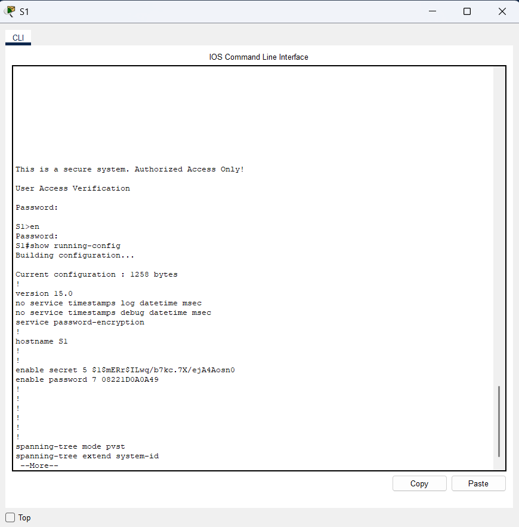
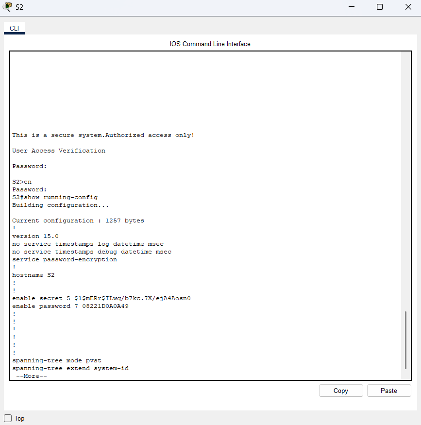
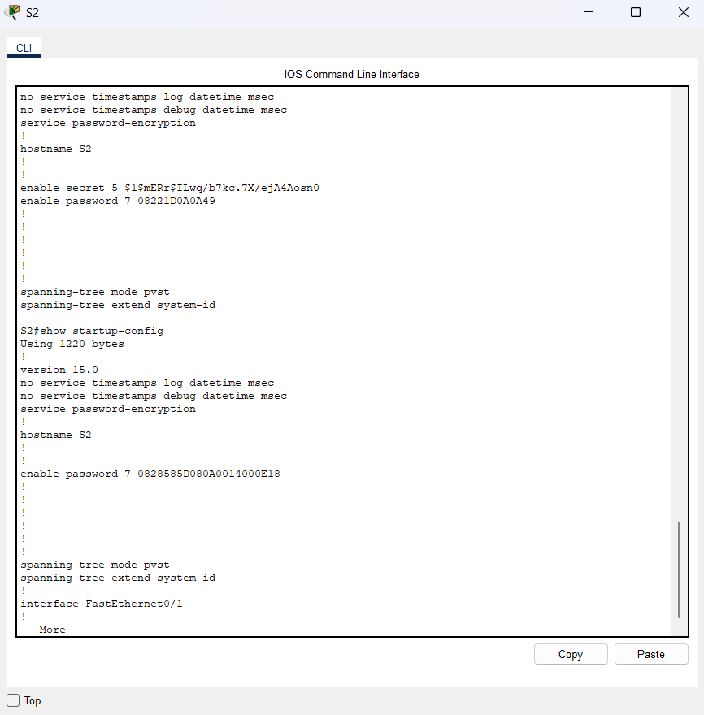

# Lab 02 – Configure Initial Switch Settings


## Objective


The objectives of this lab were to:

- Verify the default switch configuration.
- Configure basic switch settings.
- Secure console and privileged EXEC access.
- Configure encrypted passwords.
- Configure a Message of the Day (MOTD) banner.
- Save the switch configuration to NVRAM.
- Configure a second switch (S2).


## Lab Environment


- Cisco Packet Tracer
- Cisco Catalyst 2960 Switches
- Cisco IOS CLI


## Part 1 – Verify the Default Switch Configuration


I accessed the Cisco switch through the CLI and entered privileged EXEC mode using the `enable` command.

I examined the current switch configuration using:

```text

show running-config
```

This allowed me to review the current configuration of the switch, including its interfaces and VTY lines.


## Part 2 – Configure Basic Switch Security


I configured the basic switch settings and secured access to the switch.

The configuration included:

- Assigning the hostname `S1`.
- Securing console access with password authentication.
- Configuring an enable password.
- Configuring an encrypted enable secret.
- Enabling password encryption.

The following commands were used during the configuration:

```text

hostname S1

line console 0

password <configured-password>

login

enable password <configured-password>

enable secret <configured-secret>

service password-encryption
``` 

### Result

The switch was successfully configured with basic access controls and password encryption.

### Evidence




## Part 3 – Configure a MOTD Banner


I configured a Message of the Day (MOTD) banner to display a security warning when users access the switch.

The configured banner was:

```text

This is a secure system. Authorized Access Only!
```

### Result

The MOTD banner was successfully configured and displayed during access to the switch.

The banner provides a warning that access to the system is restricted to authorized users.


## Part 4 – Save Configuration to NVRAM


I saved the running configuration to NVRAM using the `copy running-config startup-config` command.

I then verified the saved configuration using:

```text

show startup-config
```

### Result

The switch configuration was successfully saved and verified in the startup configuration.

### Evidence


## Part 5 – Configure S2


I configured the second switch, S2, using the same basic security configuration principles.

The configuration included:

- Assigning the hostname `S2`.
- Securing console access with password authentication.
- Configuring an enable password.
- Configuring an encrypted enable secret.
- Enabling password encryption.
- Configuring a MOTD banner.
- Saving the configuration.

### Result

S2 was successfully configured with the required basic security settings.

### Evidence






## What I Learned


Through this lab, I learned how to:

- Access Cisco IOS privileged EXEC mode.
- Examine switch configurations using `show running-config`.
- Configure a switch hostname.
- Secure console access using password authentication.
- Protect privileged EXEC mode using an enable secret.
- Encrypt configured passwords using `service password-encryption`.
- Configure a Message of the Day (MOTD) banner.
- Save the running configuration to the startup configuration.
- Verify the saved configuration using `show startup-config`.
- Apply basic security configuration to multiple switches.


## Key Commands Practiced


```text

enable

show running-config

configure terminal

hostname

line console 0

password

login

enable password

enable secret

service password-encryption

banner motd

copy running-config startup-config

show startup-config
```


## Lab Conclusion


This lab provided hands-on experience with basic Cisco switch configuration and access security. I practiced securing console and privileged EXEC access, encrypting passwords, configuring an MOTD banner, and saving configurations to NVRAM. The same security configuration principles were also applied to a second switch.

